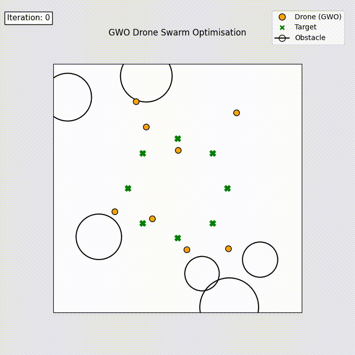

# Grey Wolf Optimisation for 3D Drone Swarm Formation

This project applies **Grey Wolf Optimisation (GWO)** to coordinate a multi-drone swarm in a bounded 3D environment.  
The objective is to achieve a circular target formation while avoiding collisions and obstacles while maintaining energy-efficient positioning.

The optimisation uses the alpha–beta–delta leader hierarchy of GWO to iteratively update drone positions toward optimal formation.

---

## Simulation Results

### Swarm Optimisation Process  
The swarm evolves from random initial positions toward the target circular formation while avoiding obstacles.



### Final Drone vs Target Positions  
Optimised drone positions compared with desired target formation.


---

## Method Overview

The optimisation minimises a multi-objective fitness function combining:

- formation error (Hungarian assignment)
- inter-drone collision penalty
- obstacle avoidance penalty
- energy term

Example best fitness from the simulation:


GWO Best fitness: 5.844987430191299
formation: 2.1679
collision: 0.0
obstacle: 0.0
energy: 10.3413


---

## Environment

- 3D bounded space: 50 × 50 × 20  
- 8 drones  
- 6 circular obstacles  
- circular target formation  

---

## Repository Structure


data/ datasets 
plots/ visualisations
output/ animation outputs
notebooks/ main simulation notebook


---

## Installation

```bash
pip install -r requirements.txt
Run the Simulation

Open the notebook and run all cells:

notebooks/gwo-on-drone-dataset.ipynb

The simulation will:

initialise swarm and obstacles

run Grey Wolf Optimisation

generate animation

plot final formation

Applications

drone swarm coordination

multi-agent formation control

obstacle-aware path planning

swarm intelligence research

metaheuristic optimisation benchmarking
